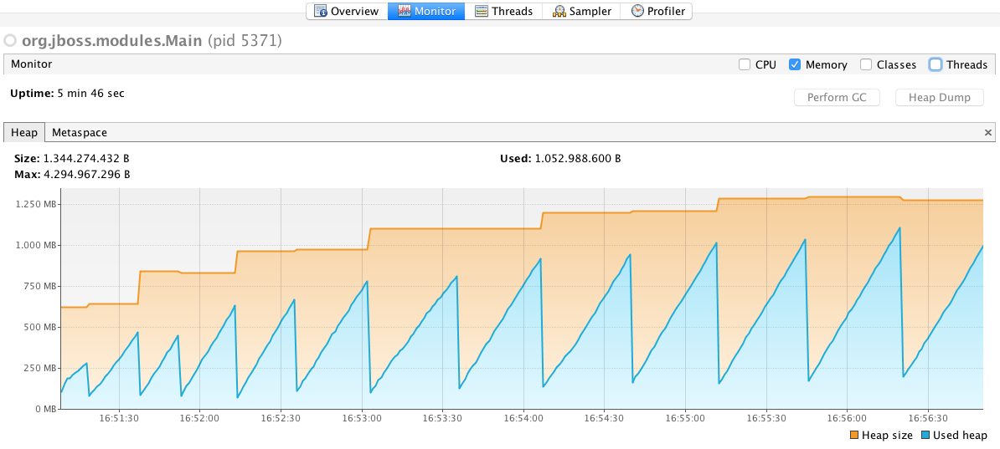
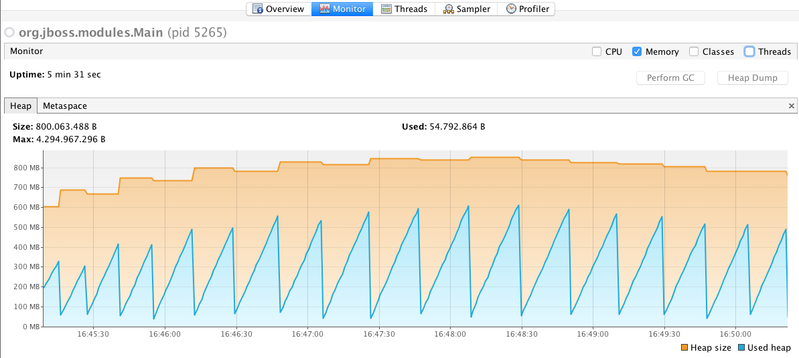

cdi-ejb-memoryleak: an example of how to easily get trapped in to a memory leak with CDI 1.0
================================================================

Example project mentioned in the following blog post:
https://blog.akquinet.de/2017/01/04/dont-get-trapped-into-a-memory-leak-using-cdi-instance-injection

What is it?
-----------

The `cdi-ejb-memoryleak` example demonstrate how you can easily get trapped in to a memory leak while using CDI 1.0 in conjunction with EJBs.

This is a simple webapplication providing 3 REST endpoints:
- one leading to a memory leak over time
- one which shows a workaround and fix to prevent the memory leak under CDI 1.0
- one which shows a workaround and fix to prevent the memory leak under CDI 1.1 using a new API enhancement introduced in this version

There is a simple REST client as an integrationtest which is calling these endpoints to show the effect.

Build and Run this example
-------------------------

- To simply build the application just enter

        mvn install
- The following will automatically download and run a wildfly 10 instance, deploying the example app and having the testcase run which would lead to a memory leak eventually.

        mvn clean install -PtestWithMemoryLeak 
- The folling will do the same but will use the workaround/fix for CDI 1.0

        mvn clean install -PtestWithMemoryLeak,fixCDI10
- The folling will do the same but will use the workaround/fix for CDI 1.1

        mvn clean install -PtestWithMemoryLeak,fixCDI11
 

Attach Profiler to see memory consumption
--------------------

To finally see the differences in memory consumption with and without the fixes you can easily attach your favority java profiler (e.g. visual-vm).
    
VisualVM showing increasing heap usage over time:

VisualVM showing constant Heap usage over time:
